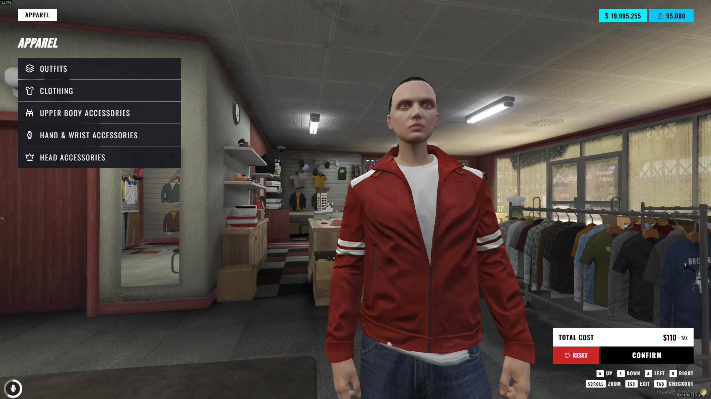
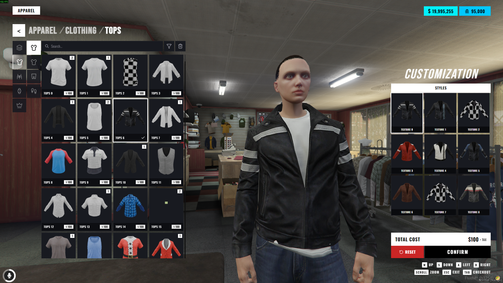
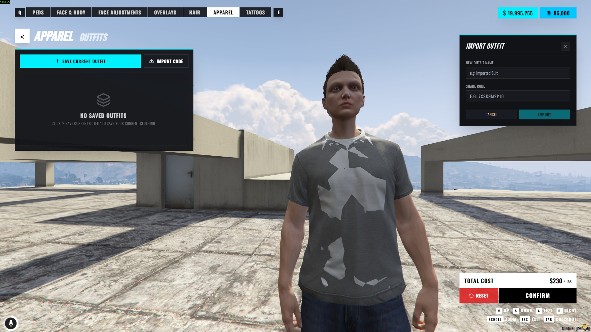
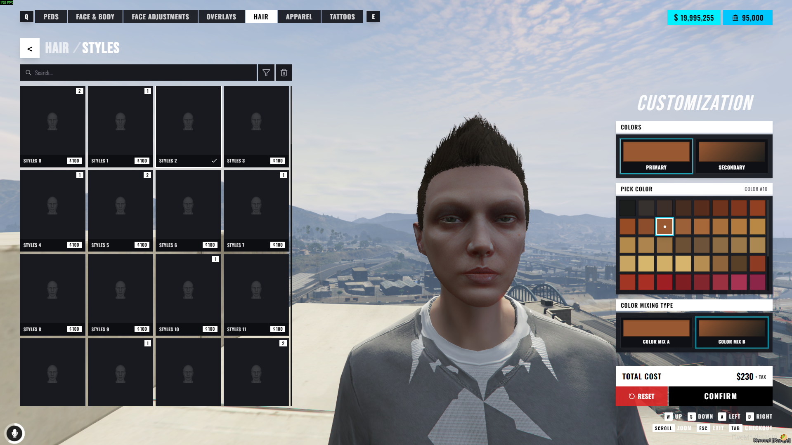
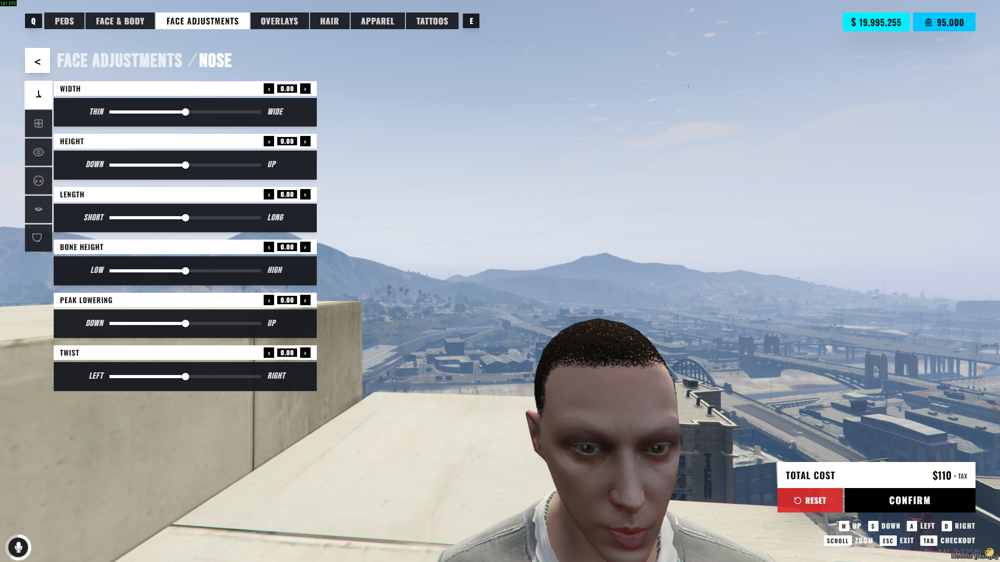
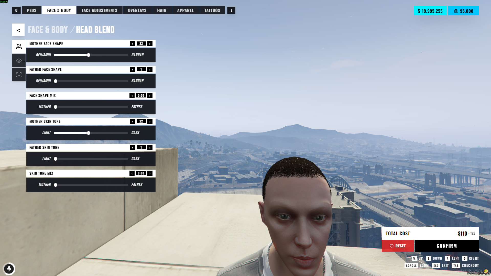
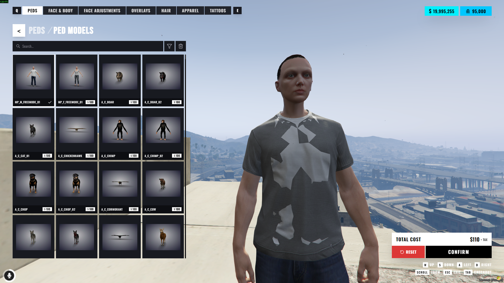
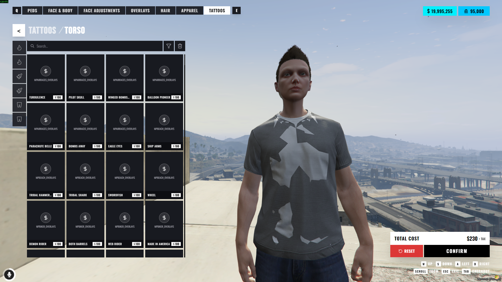

# 🌟 NoPixel Inspired Clothing (`illenium-appearance`)

Modern FiveM clothing & player customization menu inspired by **NoPixel**.  
Redesign by **Haaasib**. Full credit to **iLLeniumStudios** for the base `illenium-appearance` script!

---

## 📸 Previews










---

## ⚡ Quick Install & Customization

1. Place `illenium-appearance` into your resources directory.
2. Add to your `server.cfg`:
```cfg
ensure oxmysql
ensure qbx_core # or qb-core / es_extended
ensure illenium-appearance
```
3. Restart server. (Database tables are automatically created on startup).

> 🎨 **UI Customization**: Full source code is included under the `/web` folder (React + TypeScript + TailwindCSS). Feel free to edit, rebuild (`npm run build`), and customize the UI however you like!

---

## 💬 Links & Support

- 💬 **Discord Support**: [https://discord.gg/kj3bWdD7uK](https://discord.gg/kj3bWdD7uK)
- 🛒 **Store**: [https://tebex.haaasib.dev/](https://tebex.haaasib.dev/)
- 📦 **GitHub Repository**: [https://github.com/Haaasib/illenium-appearance](https://github.com/Haaasib/illenium-appearance)
- 📦 **Base Script**: [iLLeniumStudios Base](https://github.com/iLLeniumStudios/illenium-appearance)