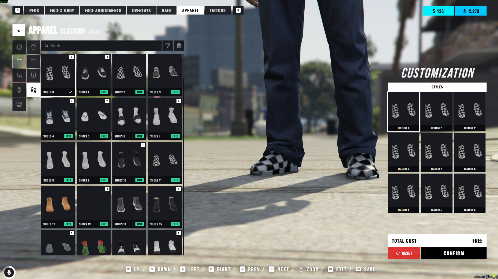
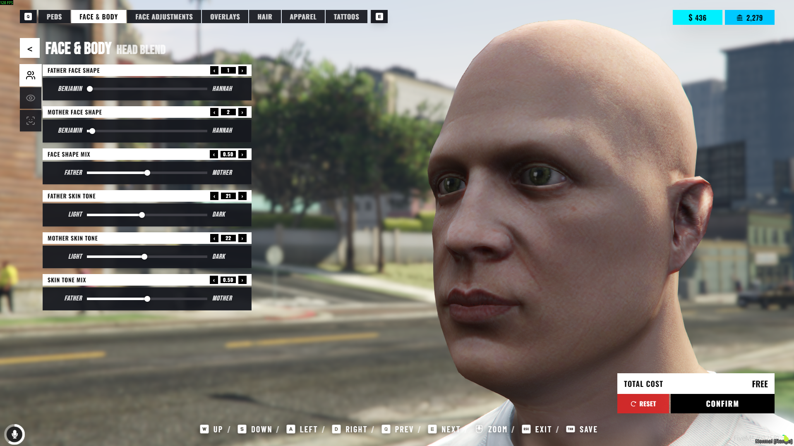
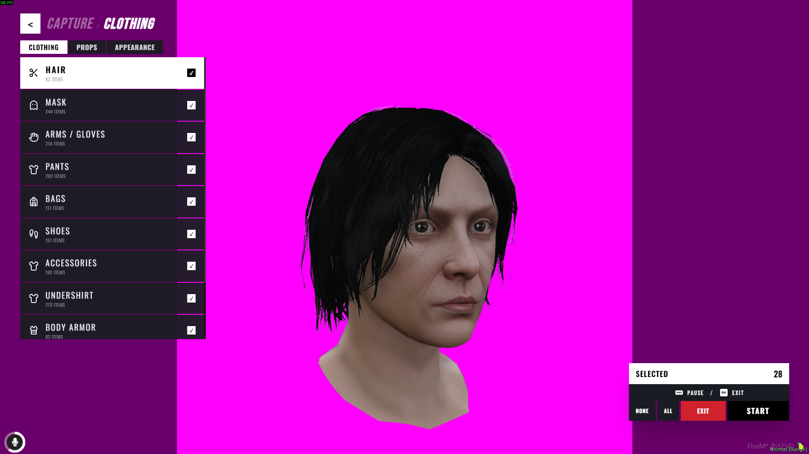

# 🌟 NoPixel Inspired Clothing (`illenium-appearance`)

Modern FiveM clothing & player customization menu inspired by **NoPixel**.  
Redesign by **Haaasib**. Full credit to **iLLeniumStudios** for the base `illenium-appearance` script!  
`/capturecloth` is based on **[uz_AutoShot](https://github.com/uz-scripts/uz_AutoShot)** by **uz-scripts**.

---

## 📸 Previews








---

## ⚡ Quick Install & Customization

1. Place `illenium-appearance` into your resources directory.
2. Add to your `server.cfg`:
```cfg
ensure oxmysql
ensure qbx_core # or qb-core / es_extended
ensure illenium-appearance
```
3. Restart server. (Database tables are automatically created on startup).

> 🎨 **UI Customization**: Full source code is included under the `/web` folder (React + TypeScript + TailwindCSS). Feel free to edit, rebuild (`npm run build`), and customize the UI however you like!

---

## Clothing images

`UseCdn = true` — ShortByte vanilla pack  
`UseCdn = false` — your own captures

Custom setup:
1. `UseCdn = false`
2. Paste Fivemanage `ApiKey` (leave `BaseUrl` empty)
3. `ensure screenshot-basic` then `ensure illenium-appearance`
4. In-game: `/capturecloth` — first upload fills `BaseUrl` in config

```lua
Config.ClothingImages = {
    UseCdn = false,
    Fivemanage = {
        ApiKey = "YOUR_KEY",
        BaseUrl = "",
    },
}
```

---

## Links & Support

- 💬 **Discord Support**: [https://discord.gg/kj3bWdD7uK](https://discord.gg/kj3bWdD7uK)
- 🛒 **Store**: [https://tebex.haaasib.dev/](https://tebex.haaasib.dev/)
- 📦 **GitHub Repository**: [https://github.com/Haaasib/illenium-appearance](https://github.com/Haaasib/illenium-appearance)
- 📦 **Base Script**: [iLLeniumStudios Base](https://github.com/iLLeniumStudios/illenium-appearance)
- 📸 **Capture Cloth**: [uz_AutoShot](https://github.com/uz-scripts/uz_AutoShot) by uz-scripts
